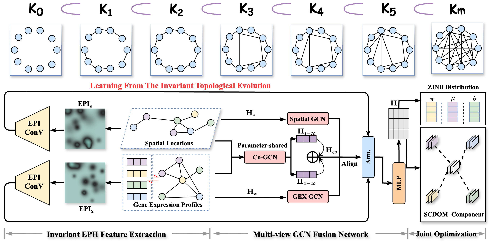
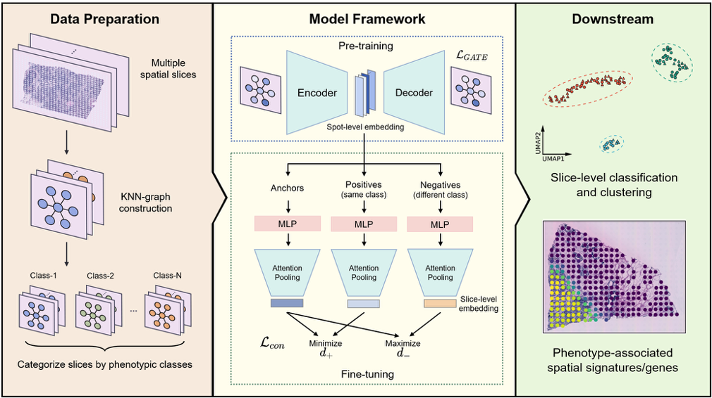
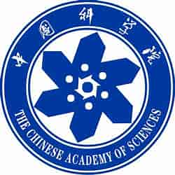
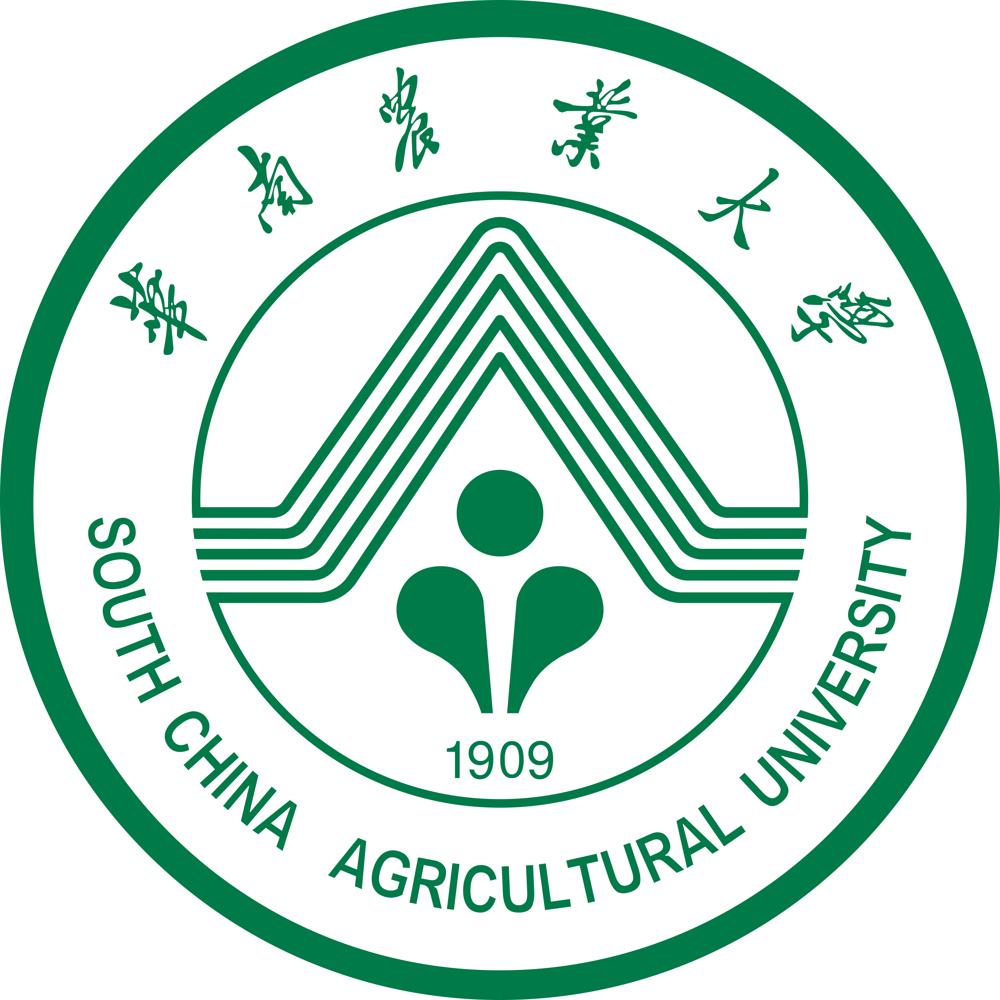
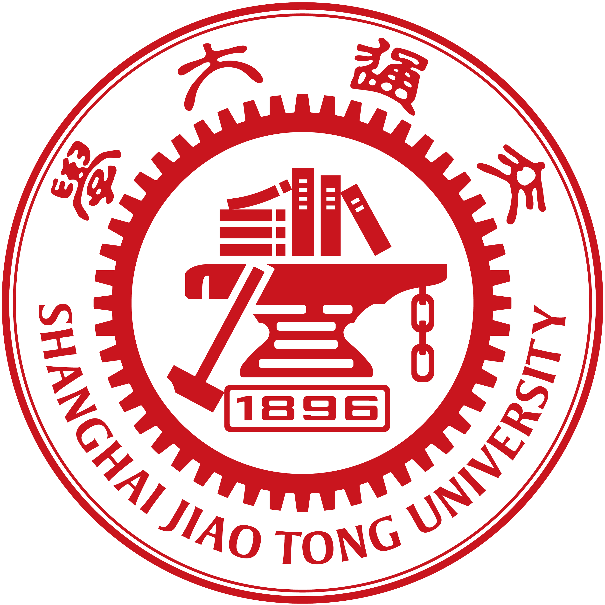








I am Chenkai Guo (郭臣凯), a third-year MS student at Prof.[Guangdun Peng](https://english.gibh.cas.cn/people/faculty/202409/t20240905_684956.html) (彭广敦)'s Lab at [Guangzhou Institutes of Biomedicine and Health (GIBH)](https://english.gibh.cas.cn/), Chinese Academy of Sciences (CAS). Previously, I obtained B.S. in College of Life Sciences from South China Agricultural University (SCAU). My research interests focuses on developing AI/ML algorithms for single-cell and spatial omics. During my spare time, I enjoy playing billards and computer games.

<!-- Feel free to reach out to me via email or  at any time. I'm always happy to connect. -->

I am currently applying for PhD position starting in Fall 2026. If you find my background of any interest, please feel free to email me or add me on [WeChat](../images/wechat.jpg). Thanks for your consideration!

# 🔥 Recent News
- *October 2025*: I am honored to obtain the National Scholarship in China.
- *August 2025*: SPHENIC preprint is now available on *arXiv* now.
- *February 2025*: 🎉🎉 PASSAGE is accepted by *Small Methods* as a cover story.
- *September 2024*: PASSAGE preprint is now available on *bioRxiv* now.
- *July 2023*: New journey at GIBH, CAS.

# 📝 Publications 
(*: equal contribution, ✉: corresponding authors)

arXiv

[SPHENIC: Topology-Informed Multi-View Clustering for Spatial Transcriptomics](https://arxiv.org/abs/2508.10646)
**Chenkai Guo**, Yikai Zhu, Jing Yangum, Renxiang Guan, Por Lip Yee, Guangdun Peng✉, Dayu Hu ✉

**Keywords**
- Persistent Homology; 
- Multi-view Clustering; 
- Graph Learning;

<!-- ------ -->

Small Methods

[Learning Phenotype Associated Signature in Spatial Transcriptomics with PASSAGE](https://onlinelibrary.wiley.com/doi/abs/10.1002/smtd.202401451)
**Chen-Kai Guo\***, Chen-Rui Xia\*, Guangdun Peng✉, Zhi-Jie Cao✉, Ge Gao✉

**Keywords**
- Multi-slice Spatial Analysis; 
- Graph Attention Network;
- Contrastive Learning;

Jincan Ke, Jian Xu, Jia Liu, Yumeng Yang, **Chenkai Guo**, Bingbing Xie, Guizhong Cui, Guangdun Peng✉, and Shengbao Suo✉. "[High-resolution mapping of single cells in spatial context.](https://www.nature.com/articles/s41467-025-61667-4)" *Nature Communications* 16, no. 1 (2025): 6533.

Xiaogao Meng\*, Wenjia Li\*, Jian Xu, Yao Yao, An Gong, Yumeng Yang, Fangfang Qu, **Chenkai Guo**, Hui Zheng, Guizhong Cui✉, Shengbao Suo✉, Guangdun Peng✉. "[Spatiotemporal transcriptome atlas of developing mouse lung.](https://www.sciencedirect.com/science/article/pii/S2095927325002403)" *Science Bulletin* (2025).

Nicola Murgia\*, Yuan Ma\*, Syeda Sadia Najam\*, Yu Liu, Joanna Przybys, **Chenkai Guo**, Witold Konopka, and Ilya A. Vinnikov✉. "[In vivo reductionist approach identifies miR-15a protecting mice from obesity.](https://www.frontiersin.org/journals/endocrinology/articles/10.3389/fendo.2022.867929/full)" *Frontiers in Endocrinology* 13 (2022): 867929.

# 🎓 Educations
  &emsp; [Chinese Academy of Sciences](https://www.cas.cn/)                           
  &emsp; M.S. student in Cellular Biology, in Guangzhou Institutes of Biomedicine and Health (GIBH), Chinese Academy of Sciences (CAS), advised by Prof. [Guangdun Peng](https://english.gibh.cas.cn/people/faculty/202409/t20240905_684956.html). *2023.09 - present* 

  &emsp; [South China Agritural University](https://scau.edu.cn/)                           
  &emsp; B.S. in National Scientific Base of Life Sciences, College of Life Sciences, advised by Prof. [Guohui Zhu](https://life.scau.edu.cn/2018/0809/c3194a107213/page.htm), Prof. [Faqiang Li](https://life.scau.edu.cn/2018/0809/c9944a107188/page.htm), and Prof. [Mei Hong](https://life.scau.edu.cn/2018/0809/c3194a107236/page.htm). *2019.09 - 2023.06* 

# 💻 Internships
  &emsp; [Peking University](https://www.pku.edu.cn/)                           
  &emsp; Visiting student, Biomedical Pioneering Innovation Center(BIOPIC), Peking University, advised by Prof.[Ge Gao](https://icg.pku.edu.cn/kxyj/yjtd/269282.htm). 2023.09 - 2024.09

  &emsp; [Chinese Academy of Sciences](https://www.cas.cn/)                           
  &emsp; Undergraduate Innovation and Entrepreneurship Training Program, in Guangzhou Institutes of Biomedicine and Health (GIBH), Chinese Academy of Sciences (CAS), advised by Prof. [Guangdun Peng](https://english.gibh.cas.cn/people/faculty/202409/t20240905_684956.html). *2022.08 - 2023.08* 

  &emsp; [Shanghai Jiao Tong University](https://www.sjtu.edu.cn/)                           
  &emsp; Internship, School of Life Sciences and Biotechnology, Shanghai Jiao Tong University, advised by Prof.[Ilya A. Vinnikov](https://life.sjtu.edu.cn/teacher/Ilya). 2021.07 - 2021.09

# 🎖 Honors and Awards

- *October 2025*, National Scholarship in China
- *October 2025*, Outstanding Poster Award (second prize) in the 14th National Conference on Bioinformatics and Systems Biology
- *May 2025*, Pacemaker to Merit Student
- *May 2025*, Second Prize Scholarship
- *December 2024*, Outstanding Poster Award in Graduate Academic Forum at GIBH
- *September 2023*, Global Gold Medal of iGEM competition (Advisor)
- *June 2023*, Outstanding Undergraduate Student of SCAU
- *November 2022*, First Prize Scholarship
- *September 2021*, Global Gold Medal of iGEM competition (Drylab member)

<!-- # 🛠️ Academic Services
Conferences:
- *AAAI'26*.

Journals:
- IEEE Signal Processing Letters. -->

# 💬 Talks
- *July 2025*, Exploring Phenotype Associated Signatures in Multiple Spatial Transcriptomic Slices, GIBH Graduate Academic Forum
- *May 2025*, Exploring Phenotype Associated Signatures in Multiple Spatial Transcriptomic Slices, The 2nd GIBH Youth Forum

# 🔗 Cooperators
I am deeply grateful to all the colleagues I have had the honor of collaborating with, both in the past and presently.

SPHENIC project:
 * Prof. [Dayu Hu](http://www.bmie.neu.edu.cn/2025/0721/c8375a289860/page.htm) (College of Medicine and Biological Information Engineering, Northeastern University)
 * Prof. [Por Lip Yee](https://umexpert.um.edu.my/porlip) (Department of Computer System and Technology, University of Malaya)

PASSAGE project:
 * Prof. [Ge Gao](https://icg.pku.edu.cn/kxyj/yjtd/269282.htm) (BIOPIC, Peking University)
 * Dr. [Zhi-Jie Cao](https://www.gao-lab.org/index.php/people-caozj/) (BIOPIC, Peking University)
 * Dr. [Chen-Rui Xia](https://www.gao-lab.org/index.php/people-xiacr/) (BIOPIC, Peking University)

Career in Penglab:
 * Prof. [Guizhong Cui](https://www.gzlab.ac.cn/Team/index_138.html) (Guangzhou Laboratory)
 * Prof. [Dongye Wang](http://stemlab.gibh.ac.cn/yjtd/fyjyn/202503/t20250313_484538.html) (GIBH, Chinese Academy of Sciences)
 * Prof. Guangyu Zhang (Chongqing Medical University)
 * Prof. Ying Chen (Yangzhou University)
 * Dr. Mingyue Guo (University of Pennsylvania)
 * Dr. Xiaogao Meng (Guangzhou Laboratory)
 * Dr. Yao Yao (GIBH, Chinese Academy of Sciences)
 * Dr. Jincan Ke (GIBH, Chinese Academy of Sciences)
 * Dr. Haoxian Wang (GIBH, Chinese Academy of Sciences)

# 🌏 Visitor Map

