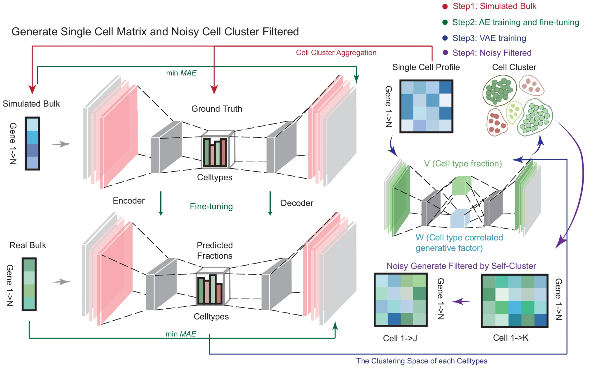
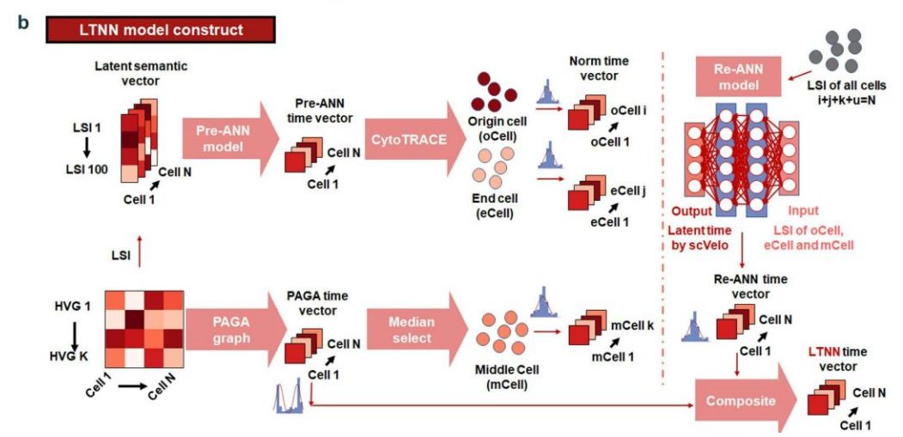

Hi! I am Lei Hu (胡磊), the third year Ph.D. candidate of Cell Biology Lab (细胞生物学实验室) at [School of Life Sciences](https://sls.westlake.edu.cn/en/), [Westlake University](https://en.westlake.edu.cn/) (西湖大学生命科学学院), advised by chair professor [Hongtao Yu](https://en.westlake.edu.cn/faculty/hongtao-yu.html). I am also the Ph.D. student of [Artificial Intelligence and Computational Biology (AICB) Lab (人工智能与计算生物学实验室)](https://aicb.lab.westlake.edu.cn/) at the Department of Artificial Intelligence, [School of Engineering](https://en-soe.westlake.edu.cn/) (西湖大学工学院人工智能系), co-advised by professor [Jianyang Zeng](https://en.westlake.edu.cn/faculty/jianyang-zeng.html). 

Previously, I received B.E. in Automation and B.S. in Biotechnology from [University of Science and Technology Beijing](http://en.ustb.edu.cn/) (北京科技大学高等工程师学院/化学与生物工程学院). I also studied at [Central South University](https://en.csu.edu.cn//) (中南大学自动化学院) as an exchange student.

My main research interest focus on **AI for Life Sciences**, supported by the National Natural Science Foundation Basic Research Grants Program for Doctoral Students (国家自然科学基金青年学生基础研究项目(博士研究生)).

## 💬 Recent News
  * *June,* *2025*. Ph.D. student → Ph.D. candidate.
  * *December,* *2024*. I am honored to be supported by the **National Natural Science Foundation Basic Research Grants Program for Doctoral Students (国家自然科学基金青年学生基础研究项目(博士研究生))**.
  * *October,* *2024*. I am honored to receive the **National Scholarship !**
  * *September,* *2024*. Congratulations! My collaborator, Peng Liu has been admitted to **Department of Automation, Tsinghua University !**
  * *Jun,* *2024*. [OmicVerse: A Framework for Bridging and Deepening Insights Across Bulk and Single-Cell Sequencing](https://www.nature.com/articles/s41467-024-50194-3) accepted to **Nature Communications !**

## 📝 Recent Publications

<table style="border-collapse: collapse; width: 100%;">
  <tr>
    <td style="border: 1px solid black; padding: 10px;">
      
    </td>
    <td style="border: 1px solid black; padding: 10px;">
      <b><i>OmicVerse: A Framework for Bridging and Deepening Insights Across Bulk and Single-Cell Sequencing.</i></b> 
      Zehua Zeng*,✉, Yuqing Ma*, <b>Lei Hu*</b>, Bowen Tan, Peng Liu, Yixuan Wang, Cencan Xing✉, Yuanyan Xiong✉, Hongwu Du✉. 
      <b>Nature Communications</b>, 15, 5983 (2024). 
      
      <a href="https://www.nature.com/articles/s41467-024-50194-3">Paper</a>, <a href="https://doi.org/10.1101/2023.06.06.543913">Biorxiv</a> 
      
      <a href="https://github.com/Starlitnightly/omicverse">Code</a>, <a href="https://github.com/Starlitnightly/omicverse-reproducibility">Reproducibility</a>, <a href="https://starlitnightly.github.io/omicverse/">Tutorials</a> 
    </td>
  </tr>
  <tr>
    <td style="border: 1px solid black; padding: 10px;">
      
    </td>
    <td style="border: 1px solid black; padding: 10px;">
      <b><i>scLTNN: an innovative tool for automatically visualizing single-cell trajectories.</i></b> 
      Cengcan Xing*, Zehua Zeng*,✉, <b>Lei Hu*</b>, Jianing Kang, Shah 
Roshan, Yuanyan Xiong✉, Hongwu Du✉, Tongbiao Zhao✉. 
      <b>Bioinformatics Advances</b>, vbaf033. 
      
      <a href="https://academic.oup.com/bioinformaticsadvances/advance-article/doi/10.1093/bioadv/vbaf033/8043205">Paper</a>, <a href="https://doi.org/10.1101/2022.09.28.510020">Biorxiv</a> 
      
      <a href="https://github.com/Starlitnightly/scLTNN">Code</a>, <a href="https://scltnn.readthedocs.io/en/latest/index.html">Tutorials</a> 
    </td>
  </tr>
</table>

## 📝 Preprints

  [1] **Lei Hu\***, Shichen Zhang\*, Xuting Zhang\*, Yihai Luo\*, Haoteng Gu, Peng Liu, Sheng Mao, Li Chen, Yuhao Xia, Minghao Yang, Sai Zhang, Yaosen Min, Han Li, Peizhuo Wang, Hongtao Yu✉, Jianyang Zeng✉, **STARNet enables spatially resolved inference of gene regulatory networks from spatial multi-omics data**, *bioRxiv, 2025: 2025.08 21.671434.* [[BioRxiv](https://www.biorxiv.org/content/10.1101/2025.08.21.671434v1)]

  [2] Yapeng Ji, Junyao Jiang, **Lei Hu**, Peng Lin, Mingshan Zhou, Minkai Wang, Yuchen Ji, Xianzhi Liu, Dongming Yan, Adwait Sathe, Bret Evers, Chao Xing, Xuelian Luo, Qi Xie, Weike Pei, Zhenyu Zhang, Song Hu, Yang Guo, Hongtao Yu✉, **Targeting necrotic lipid release in tumors enhances immunosurveillance and cancer immunotherapy of glioblastoma**. (Cell Research, accepted)

  [3] **Lei Hu\***, Peng Liu\*, Zheming Zhang\*, Yihan Zhao\*, Yanchun Wang, Xin Zhang, Shuli Sang, Xiaopeng Cao, Sheng Yao, Yang Fei, Feide Liu, Chunjie Liu, Zehua Zeng✉, Hongwu Du✉, **ScRNA-seq and Spatial Transcriptome of Gastric Mucosa Discovers the Immune Suppressive Mechanisms in *Helicobacter Pylori* Infection**. (iMetaOmics, major revision)

  [4] Yihan Zhao\*, Peng Liu\*, **Lei Hu\***, Mingxi Ke, Nan Min, Zehua Zeng✉, Hongwu Du✉, **Chromatin and Gene Regulatory Dynamics of Optic Nerve Invasion in Retinoblastoma at Single-Cell Resolution**, *bioRxiv, 2023: 2023.05. 10.540147.* [[BioRxiv](https://doi.org/10.1101/2023.05.10.540147)]

  [5] Yushuai Wu, Ting Zhang, Hao Zhou, Hainan Wu, Hanwen Sunchu, **Lei Hu**, Xiaofang Chen, Suyuan Zhao, Gaochao Liu, Chao Sun, Jiahuan Zhang, Yizhen Luo, Peng Liu, Zaiqing Nie✉, Yushuai Wu✉, **DeepCRE: Transforming Drug R&D via AI-Driven Cross-drug Response Evaluation**, *arXiv preprint arXiv:2403.03768, 2024.* [[arXiv](https://arxiv.org/abs/2403.03768)]
  
  
## 📖 Education
  &emsp; [Westlake University](https://www.westlake.edu.cn/)                           
  &emsp; Ph.D. student in Biology, School of Life Sciences, advised by Prof. [Hongtao Yu](https://en.westlake.edu.cn/faculty/hongtao-yu.html) and Prof. [Jianyang Zeng](https://en.westlake.edu.cn/faculty/jianyang-zeng.html). 2023.08 - Present

  &emsp; [University of Science and Technology Beijing](http://en.ustb.edu.cn/) （GPA: 3.76/4.0）      
  &emsp; B.E. in Automation, [School of Advanced Engineering](https://gcsxy.ustb.edu.cn/), advised by Prof. [Hongwu Du](http://huasheng.ustb.edu.cn/shiziduiwu/jiaoshixinxi/2020-06-10/244.html) at [112lab](https://112lab.asia/people) and Lecturer [Rongbin Li](https://metall.ustb.edu.cn/szdw/szdwxsjs/ysjsyjx1/jsszbsh1/lrb1/index.htm). 2019.09-2023.06

  &emsp; [University of Science and Technology Beijing](http://en.ustb.edu.cn/)    
  &emsp; B.S. in Biotechnology, School of Chem. and Bio. Engineering. 2020.09-2023.06

  &emsp; [Central South University](https://en.csu.edu.cn//) （GPA: 4.0/4.0）   
  &emsp; Exchange Student, School of Automation, 2021.09-2022.01

## 👑 Awards and Honors
  + 2025: Outstanding Youth League Members of Hangzhou Education Bureau System (杭州教育系统优秀共青团员)
  + 2024: National Natural Science Foundation Basic Research Grants Program for Doctoral Students (国家自然科学基金青年学生基础研究项目(博士研究生))
  + 2024: National Scholarship
  + 2024: Innovation Awards, Westlake University
  + 2023: Dean Award (Top Award of Undergraduate Students)
  + 2023: "San Hao" Graduate
  + 2023: Outstanding Graduation Thesis of USTB
  + 2022: Zhongtian Steel Scholarship
  + 2022: Huawei Intelligent Base Scholarship
  + 2021: Tongda Scholarship (1/146)
  + 2021: Outstanding "San Hao" Student 
  + 2020: People Scholarship (First Class)

## 🎤 Talks
  + Spatiotemporal Mapping of Gene Regulatory Networks using Spatial Multi-omics Data, Systems and Synthetic Biology Program ECR Seminar, School of Life Sciences, Westlake University, June 2025.
  + [New functions and progress of OmicVerse, the python based framework for transcriptome data analysis](https://mp.weixin.qq.com/s/JX0BKKMCkBkDO-JRq7lKpA), BiolinkX, Zhejiang University, September 2024.
  + [OmicVerse - Introduction to the python based framework for transcriptome data analysis](https://mp.weixin.qq.com/s/PHE8vePsRMs9HouJTGsf9Q), BiolinkX, Online, September 2023.

## 💻 Internships
  * 2023.03 - 2023.07 Research Intern at [AIR](https://air.tsinghua.edu.cn/), Tsinghua University, advised by Prof. [Zaiqing Nie](https://air.tsinghua.edu.cn/info/1046/1203.htm) and Postdoc [Yushuai Wu](https://air.tsinghua.edu.cn/airtd/bsh.htm).
  * 2021.11 - 2023.08 Research Intern at [112Lab](https://112lab.asia/people), University of Science and Techonology Beijing, advised by Prof. [Hongwu Du](http://huasheng.ustb.edu.cn/shiziduiwu/jiaoshixinxi/2020-06-10/244.html) and Ph.D. Student [Zehua Zeng](https://github.com/Starlitnightly) .
  * 2021.07 - 2022.07 Research Intern at [APM](http://www.apm.cas.cn), Chinese Academy of Science, advised by Prof. [Fuchun Lin](https://people.ucas.edu.cn/~linfuchun). 
  * 2020.09 - 2021.09 Research Intern at [Metall](https://metall.ustb.edu.cn/), University of Science and Techonology Beijing, advised by Lecturer [Rongbin Li](https://metall.ustb.edu.cn/szdw/szdwxsjs/ysjsyjx1/jsszbsh1/lrb1/index.htm). 

## 🔗 Co-working Students
(*I am working with some visiting/undergraduate/doctoral students and postdocs at Westlake University with chair professor Hongtao Yu and professor Jianyang Zeng*)
  * Peng Liu (undergraduate student at USTB → THU)
  * Yihan Zhao (undergraduate student at USTB → FDU)
  * Zheming Zhang (undergraduate student at CSU → CSSC)
  * Fenglei Zhang (undergraduate student at SXU → NPU)
  * [Zhaorui Jiang](https://zhaorui-bi.github.io/) (undergraduate student at OUC → PKU)
  * Haoteng Gu (undergraduate student at BJUT)
  * Peiran Lin (undergraduate student at SDU → Westlake University)
  * [Xuting Zhang](https://lxzcpro.github.io/) (undergraduate student at Westlake University)
  * Sheng Mao (undergraduate student at Westlake University)
  * Zedong Jiao (master student at XTU)

